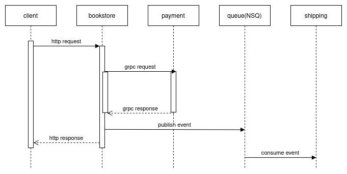

## how to start

`docker-compose up` or ` make dev-up`

## services

### client

[otelhttp](go.opentelemetry.io/contrib/instrumentation/net/http/otelhttp)(client)

### bookstore

[otelgin](go.opentelemetry.io/contrib/instrumentation/github.com/gin-gonic/gin/otelgin)(server)\
[otelgrpc](go.opentelemetry.io/contrib/instrumentation/google.golang.org/grpc/otelgrpc")(client)\
[propagation](go.opentelemetry.io/otel/propagation)(publisher)

### payment

[otelgrpc](go.opentelemetry.io/contrib/instrumentation/google.golang.org/grpc/otelgrpc")(server)

### shipping

[propagation](go.opentelemetry.io/otel/propagation)(consumer)

## jaeger UI

[http://localhost:16686/](http://localhost:16686/)

## nsd issue in docker-compose

https://stackoverflow.com/questions/48536963/nsq-cannot-consume-message-by-connecting-to-nsqlookupd